# IP

## __内容__：  
1，虚拟互联网络的概念  
2，传统的分类的IP地址和无分类域间路由选择CIDR  
3，IP数据报格式  
4，ip地址与物理地址的关系  
5，IP层转发分组的过程  
6，网络地址转换NAT

## __虚拟互联网络__：  
1. 如果我们要把数以百万计的网络都连起来，并且能够互相通信，会遇到许多需要解决的问题：
- 不同的寻址方案；
- 不同的最大分组长度； 
- 不同的网络接入机制；
- 不同的超时控制；
- 不同的差错恢复方法；
- 不同的状态报告方法；
- 不同的路由选择技术；
- 不同的用户接入控制；
- 不同的服务（面向连接服务和无连接服务）；
- 不同的管理与控制方式；
2. 用户需求多种多样，没有一种单一的网络能够适应所有用户的需求。

网络互连需要使用一些中间设备。根据中间设备所在的层次，可以有以下四种不同的中间设备：  
（1）物理层使用的中间设备叫做转发器（repeater）  
（2）数据链路层使用的中间设备叫做网桥或桥接器（bridge）  
（3）网络层使用的中间设备叫做路由器（router）  
（4）在网络层以上使用的中间设备叫做网关（gateway）  

所谓虚拟互连网络就是逻辑互连网络，它的意思就是互连起来的各种物理网络的异构性本来是客观存在的，但是我们利用ip协议就可以使这些性能各异的网络在网络层上看起来像是一个统一的网络。这种使用IP协议的虚拟互连网络可简称为IP网


使用IP网的好处是：当IP网上的主机进行通信时，就好像在一个单个网络上通信一样，它们看不见互连的各网络的具体异构细节（如具体的编址方案，路由选择协议，等等）。如果在这种覆盖全球的IP网上层使用TCP协议，那么就是现在的互联网。IP只为主机提供一种无连接、不可靠的、尽力而为的数据包传输服务  

## IP编址:
IP地址的编址方法共经过了3个历史阶段：  
（1）分类的IP地址。这是最基本的编址方法，在1981年就通过了相应的标准协议。  
（2）子网的划分。这是对最基本的编址方法的改进，其标准RFC950在1985年通过。  
（3）构成超网。这是比较新的无分类编址方法。1993年提出后很快就得到推广应用。

IP地址及其表示方法：  
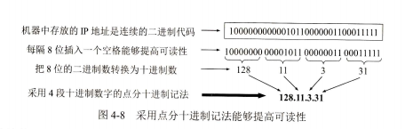  

## 分类的IP地址：
32位的IP地址采用两级的结构，由两个字段组成。第一个字段是网络号。第二个字段是主机号  
IP地址 ::= {<网络号>, <主机号>}  

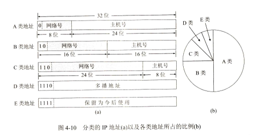    

A类（n=8），B类（n=16）和C类（n=24）地址都是单播地址（一对一通信），是最常用的。D类是多播地址（一对多通信），E是保留地址。  
32位的IP地址空间有2^32（接近43亿）个地址。A类地址空间共有2^31个地址，占整个IP地址空间的50%。B类地址空间共有2^30个地址，占整个IP地址空间的25%。整个C类空间地址共有2^29个地址，占整个IP地址的12.5%。D类和E类地址各占整个IP地址的6.25%。  

A类地址：  
- 网络号: 全为0表示“本网络”，网络号为127作为本地软件环回测试，因此A类地址可指派的网络号是126个（即2^7 - 2）.
- 主机号: 全为0表示该IP地址是“本主机”所连接到的单个网络地址（例如，若主机的IP地址为5.6.7.8，则该主机所在的网络的网络号是5，而该网络的网络地址就是5.0.0.0）,全1表示“所有的”，因此全1的主机号字段表示该网络上的所有主机。主机数是2^24-2 (16777214)

B类地址：
- 网络号：可指派网络数为2^14（16384）
- 主机号：主机数是2^16-2（65534）

C类地址：
- 网络号：网络总数 2^21（2097152）
- 主机号：主机数2^8 - 2（254）

一般不指派的特殊IP地址：  

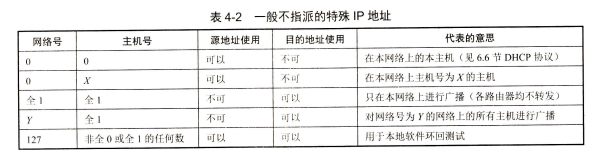

把IP地址划分为A类，B类，C类是为了更好地满足不同用户的要求，这种分类的IP地址由于网络号固定，因此方便管理，使用方便，转发分组迅速，满足当时互联网在美国的科研需求。  
但互联网在20世纪90年代迅速发展，使得ip地址数量面临枯竭。一种新的无分类编址方法就问世了。这种方法虽然也无法解决IP地址枯竭的问题，但可以推迟IP地址用尽的日子。

## __无分类编址CIDR__:
（1）网络前缀  
CIDR把网络号改称为“网络前缀”，剩下的后面部分仍然是主机号。  
IP地址 ::= {<网络前缀>, <主机号>}  
网络前缀的位数n不是固定的数，而是0-32之间的选取任意值。  
CIDR使用“斜线记法”, 或称为CIDR记法，在IP地址后面加上斜线“/”，斜线后面是网络前缀所占位数，如：128.14.35.7/20  
（2）地址块  
CIDR把网络前缀都相同的所有连续的IP地址组成一个“CIDR地址块”。一个CIDR地址块包含的IP地址数目，取决于网络前缀的位数。我们只要知道CIDR地址块中的任何一个地址。就可以知道这个地址块的起始地址和最大地址，以及地址块中的地址数。  
  
（3）地址掩码  
CIDR使用斜线记法可以让我们知道网络前缀数值。但是计算机看不见斜线记法，而是使用二进制来进行各种计算时必须使用32位的地址掩码能够从IP地址迅速算出网络地址。  
地址掩码由一连串1和接着的一连串0组成，1的个数是网络前缀的长度。在CIDR中，斜线后面的数字就是地址掩码中1的个数。  
例如：/20地址块的掩码是11111111 11111111 11110000 00000000  
把二进制的IP地址和地址掩码进行按位AND运算，即可得出网络地址。  
  
***
CIDR地址中还有三个特殊地址块  
（1）前缀n=32，即32位IP地址都是前缀，没有主机号，这其实就是一个ip地址。这个特殊地址用于主机路由  
（2）前缀n=31，这个地址块中只有两个IP地址，其主机号分别为0和1.这个地址块用于点对点链路  
（3）前缀n=0同时IP地址也是全0，即0.0.0.0/0。这用于默认路由

## IP数据报的格式：
IP数据报的格式说明协议IP都具有什么功能。  
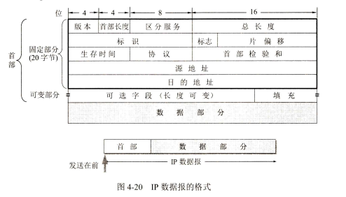  
一个IP数据报由首部和数据两部分组成。首部的前一部分长度是固定的，共20字节，后面是可选字段，其长度是可变的。  
（1）版本，占4位，协议IP版本号为4（即IPv4）, 协议IP版本号为6（即IPv6）  
（2）首部长度 占4位，首部长度字段所表示数的单位是32位字长（1个32位字长是4字节），最小是20字节，最大60字节，当IP分组的首部长度不是4字节的整数倍时，必须利用最后的填充字段加以填充。  
（3）区分服务 占8位，只有在使用区分服务DS时，这个字段才起作用。在一般的情况下都不用这个字段  
qos，dscp  
（4）总长度 总长度指首部和数据之和的长度，单位为字节。总长度为16位，2^16-1（65535字节），然而实际上不会传递这么长的数据报，因为网络层的下一层数据链路层规定了数据帧的数据字段的最大长度，即最大传送单元MTU（一般1500字节），超过MTU最大值就需要对数据报进行分片处理。  
IP数据报不是越长越好，越长传输效率得到了提高，但是路由器的转发速度就慢了。因此IP协议规定：在互联网中的所有主机和路由器，必须能够接收长度不超过576字节的数据报。576字节的由来：数据部分长度512，IP首部最大长度60，加上4字节的富余量。  
（5）标识 占16位 IP软件在存储器中维持一个计数器，每产生一个数据报，计数器就加1，并将此值赋给标识字段，当数据报由于长度超过网络的MTU而必须分片时，这个标识字段的值就被复制到所有的数据报片的标识字段中。  
（6）标志 占3位，只有两位有意义。  
最低位记为 MF(More Fragement)。MF=1表示后面还有分片的数据报 MF=0表示这是若干数据报片中的最后一个  
中间一位记为 DF(Don't Fragment)。表示不能分片。只有当DF=0时才允许分片  
（7）片偏移 占13位。指：较长的分组在分片后，某片在原分组中的相对位置
即：相对于用户数据字段的起点，该片从何处开始。  
注意：片偏移以8字节为一个单位，也就是每个分片的长度一定是8字节（64位）的整数倍，除最后一个数据报外

例：一数据报总长度为3820字节，数据部分为3800字节（使用固定首部）需要分片为长度不超过1420字节的数据报片。因为首部长度固定为20字节因此每个数据报片数据部分长度不能超过1400字节。可以分为3个数据片数据部分长度分别为1400、1400、1000.原始数据报首部被复制到各个数据报片的首部，并修改相关字段的值
              
||总长度|  标识 | MF|  DF|  片偏移|  数据部分在原数据报位置（含首尾）原始数据报|  
|----|---|-----|----|----|----|----|           
||3820|  12345|  0|   0|  0（0/8=0）|        0-3799|
|数据报片1   |1420           | 12345        |1           | 0|             0（0/8=0）                             |0-1399|
|数据报片2             |1420            |12345|        1|            0    |        175（1400/8=175）    |            1400-2799|
|数据报片3            | 1020           | 12345        |0            |0 |           350（2800/8=350）                |2800-3799|
          
若数据报片2经过某个网络还需要再次进行分片，即划分为数据报片2-1（携带800字节）和数据报片2-2（携带600字节）。那么这两个数据报片的总长度，标识，MF，DF和片偏移分别为：  
820，12345，1，0，175；  
620，12345，1，0，275  
（8）生存时间 占8位 TTL字段的功能为”跳数限制“。路由器在每次转发数据报之前就把TTL值减1.若TTL减小到零，就丢弃这个数据报，不再转发。TTL的意义是指明数据报在互联网中至多可经过多少个路由器，显然，数据报能在互联网中经过的路由器最大数值是255.若把TTL的初始值设置为1，就表示这个数据报只能在本局域网中传送。  
（9）协议 占8位，指出数据报携带的数据使用何种协议，以便使目的主机的IP层知道应将数据部分上交给哪个协议处理。  
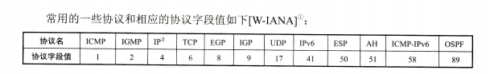  
（10）首部检验和 占16位，这个字段只检验数据报首部，但不包括数据部分。因为数据报没经过一个路由器都要重新计算首部检验和，不检验数据部分可减少计算的工作量。
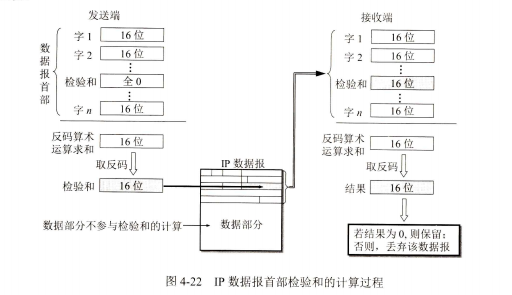  

```
原始数据为：1100，1010，0000（检验和）；
将原始数相加：1100+1010+0000=10110；
⾼位有进位加到低位：0110+1=0111；
检验和为：1000。

发送的数据为：1100，1010，1000（检验和）；
接收端验证：1100+1010+1000=1111；
取反为：0000（没有错误）
```
（11）源地址 占32位，发送IP数据报的主机的IP地址  
（12）目的地址 占32位，接收IP数据报的主机的IP地址  
可变部分就是一个选项字段。选项字段用来支持排错，测量以及安全等措施。实际上这些选项很少被使用。很多路由器都不考虑IP首部的选项字段。

## __IP地址与硬件地址__:
物理地址是数据链路层和物理层使用的地址，而IP地址是网络层和以上各层使用的地址，是一种逻辑地址。IP数据包一旦交给数据链路层，就被封装成MAC帧了。  
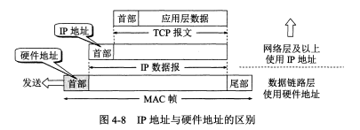  

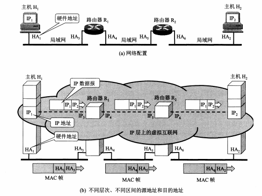   

（1）在IP层抽象的互联网上只能看到IP数据报。它的首部中的源地址和目的地址始终是IP1和IP2.  
（2）路由器只根据目的站的ip地址的网络号进行路由选择。  
（3）在局域网的链路层，只能看到MAC帧，MAC帧在不同网络上传送时，其MAC帧首部中的源地址和目的地址要发生变化。  
（4）IP层抽象的互联网屏蔽了下层这些复杂的细节。只要我们在网络层上讨论问题，就能够使用统一的，抽象的IP地址研究主机和主机或路由器之间的通信。  

问题：  
主机或路由器怎么知道应当在MAC帧的首部填入什么样的硬件地址？

## __地址解析协议ARP__：
ARP协议的用途是为了从网络层使用的IP地址，解析出在数据链路层使用的硬件地址。

地址解析协议ARP解决这个问题的方法是在主机ARP高速缓存中放一个从IP地址到硬件地址的映射表，并且这个映射表还经常动态更新（新增或超时删除）。  

每一台主机都设有一个ARP高速缓存，里面有本局域网上的各主机和路由器IP地址到硬件地址的映射表。

例如：当主机A要向本局域网上的某台主机B发送IP数据报时，就先在其ARP高速缓存中查看有无主机B的IP地址。  
- 如有，就在ARP高速缓存中查出其对应的硬件地址，再把这个硬件地址写入MAC帧，然后通过局域网把该MAC帧发往此硬件地址。  
- 如没有，主机A就自动运行ARP，然后按以下步骤找出主机B的硬件地址。  
（1）ARP进程在本局域网上广播发送一个ARP请求分组，内容是：“我的IP地址是209.0.0.5，硬件地址是00-00-C0-15-AD-18。我想知道IP地址为209.0.0.6的主机的硬件地址。”  
（2）在本局域网上的所有主机上运行的ARP进程都收到此ARP请求分组。  
（3）主机B的IP地址与ARP请求的IP地址一致，就收下ARP请求分组，并向主机A发送ARP响应分组，响应分组的主要内容是：“我的IP地址是209.0.0.6，我的硬件地址是08-00-2B-00-EE-0A。” 其余的所有主机的IP地址都与ARP请求分组中要查询的IP地址不一致，因此都不理睬这个ARP请求分组。  
注意：ARP请求分组是广播发送的，ARP响应分组是普通的单播。  
（4）主机A收到主机B的ARP响应分组后，就在其ARP高速缓存中写入主机B的IP到物理地址映射；主机B收到A的ARP请求分组时，就把主机A的这一地址映射写入主机B自己的ARP高速缓存中。  
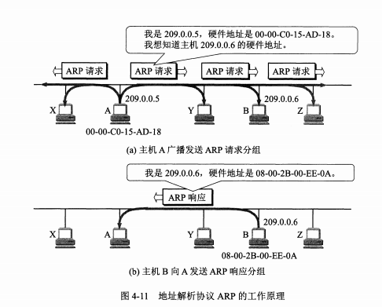  

ARP对保存在高速缓存中的每一个映射地址项目都设置生存时间（例如，10—20分钟）  
ARP是解决同一个局域网上的主机或路由器的IP地址和硬件地址的映射问题。

## __IP层转发分组的过程__:
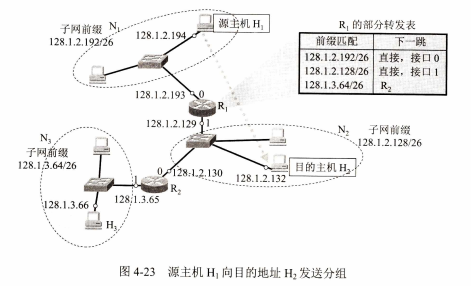

最长前缀匹配：  
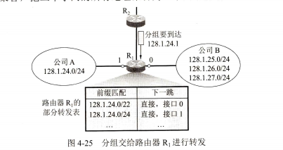  
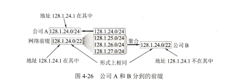  

主机路由器：采用主机路由可使网络管理人员更方便地控制和测试网络。  
主机路由网络前缀是a.b.c.d/32.

默认路由器：不管分组的最终目的的网络在哪里，都由指定的路由器R来处理。
用一个特殊前缀0.0.0.0/0来表示默认路由。

分组转发算法如下：  
（1）从收到的分组首部取出目的主机IP地址D  
（2）若查找到有特定主机路由（目的地址为D）则按这条路由的下一跳转发分组；否则从转发表中的下一行检查，执行 [3]  
（3）把这一行的子网掩码与目的地址D按位进行AND运算。  
若运算结果与本行的前缀匹配，则查找结束，按照“下一跳”所指出的进行处理（或直接交付本网络上的目的主机，或通过指定接口发送到下一跳路由器）  
否则，转发表还有下一行，重新执行 [3]  
否则执行 [4]  
（4）若转发表中有一个默认路由，把分组传送到默认路由器；  
否则, 报告转发分组出错。

当路由器收到一个待转发的分组，在从转发表得出下一跳路由器的IP地址后，网络接口软件使用ARP把下一跳的路由器IP转为MAC地址，并将MAC地址放到MAC帧首部，传送到下一跳的路由器链路层，再取出MAC帧部分交给网络层。  

## __网络地址转换NAT__:
RFC1918指明了一些专用地址。这些地址只能用于一个机构的内部通信，而不能用于和互联网上的主机通信。在互联网中的所有路由器，对目的地址是专用地址的数据报一律不进行转发。  
（1）10.0.0.0/8，即从10.0.0.0到10.255.255.255  
（2）172.16.0.0/12，即从172.16.0.0到172.31.255.255  
（3）192.168.0.0/16，即从192.168.0.0到192.168.255.255  
采用这样的专用IP地址的互联网成为专用互联网或本地互联网  
<br>
网络地址转换NAT需要在专用网连接到互联网的路由器上安装NAT软件。装有NAT软件的路由器叫作NAT路由器。

NAT工作原理  
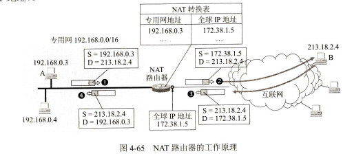  
当NAT路由器具有n个全球IP地址时，专用网内最多可以同时有n台主机接入互联网。  
<br>
为了更加有效地利用NAT路由器上的全球IP地址，现在常用的NAT转换表把运输层的端口号也利用上，使用端口号的NAT叫做NAPT

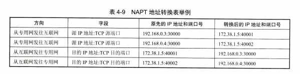
